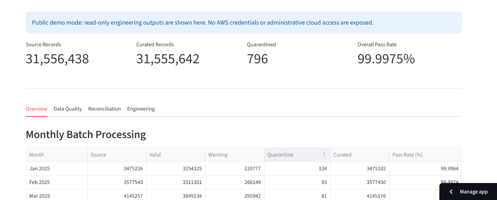
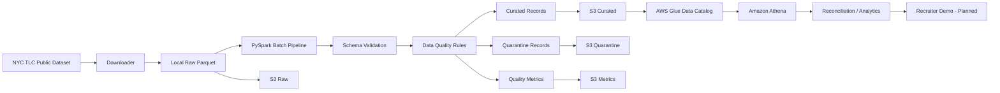
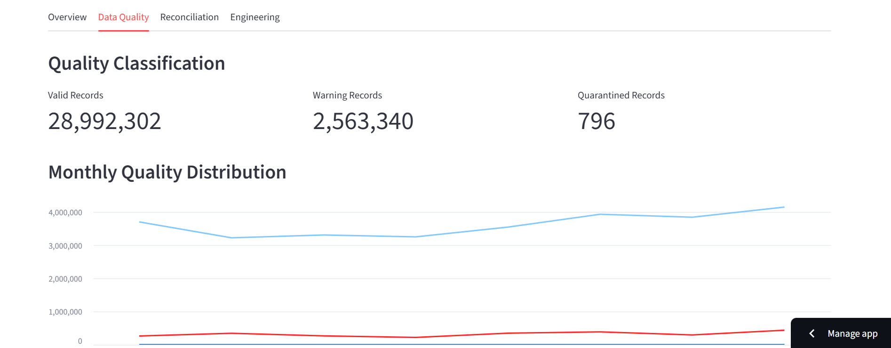
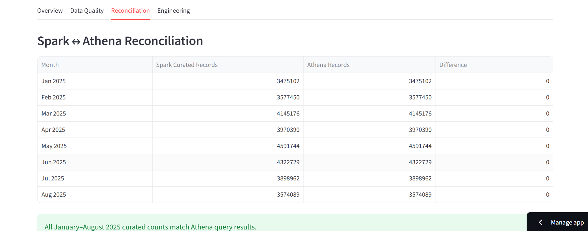

# TransitFlow

[](https://github.com/TheOrthman/transitflow/actions/workflows/tests.yml)

[](https://github.com/TheOrthman/transitflow/actions/workflows/tests.yml)
[](https://transitflowz.streamlit.app/)
[](https://www.python.org/)
[](https://spark.apache.org/)

**Live Demo:** [Open TransitFlow](https://transitflowz.streamlit.app/)
> A production-style batch data engineering platform for ingesting, validating, transforming, publishing, cataloging, and querying NYC taxi trip data using PySpark and AWS.

TransitFlow demonstrates the design of a reliable data pipeline rather than a simple analytics notebook. It processes public NYC Taxi & Limousine Commission (TLC) trip data through a layered pipeline with schema validation, record-level data quality controls, quarantine handling, checksum-based idempotency, S3 publication verification, AWS Glue partition management, and Athena reconciliation.

The current implementation processes NYC Yellow Taxi data from **January through August 2025**.

## Live Demo

**[Open TransitFlow](https://transitflowz.streamlit.app/)**

TransitFlow includes a public read-only verification dashboard where reviewers can inspect pipeline outputs, data-quality metrics, reconciliation results, and engineering controls.



---

## Project Highlights

- Processes millions of NYC Yellow Taxi records with **PySpark**
- Downloads source Parquet files with retry and atomic-write protection
- Validates required source schema before processing
- Separates records into **VALID**, **WARNING**, and **QUARANTINE**
- Preserves data-quality reasons at record level
- Generates batch-level quality metrics
- Uses SHA-256 checksums for source-file verification
- Implements processing and publication idempotency
- Publishes raw, curated, quarantine, and metrics layers to **Amazon S3**
- Stores curated data using Hive-style partitions
- Registers and repairs partitions in **AWS Glue Data Catalog**
- Queries curated datasets through **Amazon Athena**
- Reconciles local Spark output with Athena record counts
- Includes **28 passing unit tests**
- Designed for a public read-only recruiter demo

---

## What This Project Demonstrates

TransitFlow is designed to demonstrate practical data engineering concerns beyond basic ETL.

It includes:

- distributed batch processing with PySpark
- schema validation and canonicalization
- record-level warning and quarantine handling
- SHA-256 source verification
- processing idempotency
- S3 publication verification
- Hive-style partitioned storage
- AWS Glue metadata management
- incorrect partition repair
- Amazon Athena reconciliation
- unit and integration testing
- automated CI with GitHub Actions
- public read-only deployment

---

## Architecture



---

## Demo Screenshots

### Pipeline Overview


### Data Quality



### Spark-to-Athena Reconciliation



**Live application:**  
[https://transitflowz.streamlit.app/](https://transitflowz.streamlit.app/)

---

## Technology Stack

| Layer | Technology |
|---|---|
| Language | Python |
| Distributed Processing | PySpark |
| Source Format | Apache Parquet |
| Data Validation | PySpark rules + schema validation |
| Cloud Storage | Amazon S3 |
| Metadata Catalog | AWS Glue Data Catalog |
| Query Engine | Amazon Athena |
| AWS Authentication | IAM Identity Center / SSO |
| Testing | pytest |
| Version Control | Git / GitHub |
| Local Runtime | WSL2 / Linux |
| Demo Layer | Streamlit (planned) |

---

## Dataset

TransitFlow currently uses the public **NYC TLC Yellow Taxi Trip Records** dataset.

Each monthly batch contains fields such as:

- pickup and dropoff timestamps
- pickup and dropoff location IDs
- trip distance
- passenger count
- payment type
- fare amount
- tip amount
- tolls
- taxes and surcharges
- total amount

TransitFlow normalizes the source naming convention into a canonical snake_case schema before downstream processing.

Example:

```text
VendorID                  -> vendor_id
tpep_pickup_datetime      -> pickup_datetime
tpep_dropoff_datetime     -> dropoff_datetime
PULocationID              -> pickup_location_id
DOLocationID              -> dropoff_location_id
RatecodeID                -> rate_code_id
```

---

## Data Quality Architecture

TransitFlow intentionally distinguishes between records that are unusable and records that are unusual but potentially legitimate.

### Quarantine Rules

Records are quarantined when they contain conditions that make them unsafe for normal analytical use.

Current quarantine reasons include:

```text
MISSING_PICKUP_DATETIME
MISSING_DROPOFF_DATETIME
INVALID_TIME_RANGE
NEGATIVE_TRIP_DISTANCE
MISSING_PICKUP_LOCATION
MISSING_DROPOFF_LOCATION
```

### Warning Rules

Warning records remain in the curated dataset while preserving their quality flags.

Current warning reasons include:

```text
ZERO_TRIP_DISTANCE
NEGATIVE_FARE_AMOUNT
NEGATIVE_TOTAL_AMOUNT
TRIP_OVER_24_HOURS
```

Negative fare and total amounts are treated as warnings rather than automatically discarded because they may represent corrections, reversals, or other source-system behavior.

### Validation Status

Each row receives one of:

```text
VALID
WARNING
QUARANTINE
```

If a row contains both warning and quarantine conditions, `QUARANTINE` takes precedence while all applicable reasons remain attached to the record.

---

## Lineage Metadata

TransitFlow enriches processed records with operational metadata:

```text
source_file
batch_id
schema_version
ingested_at
validation_status
quarantine_reasons
warning_reasons
```

This makes individual records traceable back to their source batch and validation result.

---

## S3 Data Layout

TransitFlow separates pipeline outputs by responsibility.

```text
s3://<bucket>/
│
├── raw/
│   └── yellow_taxi/
│
├── curated/
│   └── yellow_taxi/
│       ├── year=2025/
│       │   ├── month=01/
│       │   ├── month=02/
│       │   └── ...
│       │
│       └── ...
│
├── quarantine/
│   └── yellow_taxi/
│
├── metrics/
│   ├── quality/
│   ├── downloads/
│   └── pipeline_runs/
│
└── athena-results/
```

Curated data uses **Hive-style partitioning**:

```text
year=YYYY/month=MM
```

For example:

```text
curated/yellow_taxi/year=2025/month=08/
```

---

## Idempotency

One of TransitFlow's core design goals is safe reruns.

The platform currently protects processing at multiple layers.

### 1. Processing Idempotency

Before Spark processing begins, TransitFlow calculates the SHA-256 checksum of the source file.

The run ledger is checked using:

```text
batch_id + source_checksum + SUCCESS status
```

If the same successful source batch has already been processed, expensive Spark processing can be skipped.

### 2. S3 Publication Idempotency

TransitFlow verifies that:

- the raw S3 object exists
- its stored SHA-256 metadata matches the local source checksum
- curated output contains a `_SUCCESS` marker
- quarantine output contains a `_SUCCESS` marker
- metrics output contains a `_SUCCESS` marker

This allows missing cloud artifacts to be repaired independently of Spark processing.

### 3. Glue Partition Idempotency

Glue partition registration independently verifies:

```text
partition values
+
canonical S3 location
```

A correct partition is left unchanged.

An incorrect partition can be replaced with the canonical location.

This protects the query layer from silently pointing at the wrong S3 prefix.

---

## Glue and Athena

The curated dataset is registered in AWS Glue as:

```text
Database: transitflow
Table: curated_yellow_taxi
```

Partitions:

```text
year INT
month INT
```

The physical S3 representation uses zero-padded month directories such as:

```text
month=01
month=08
```

Athena can therefore query all registered monthly curated partitions without scanning unrelated pipeline layers.

---

## Batch Results

TransitFlow currently processes January through August 2025.

| Month | Source Records | Curated Records | Quarantined |
|---|---:|---:|---:|
| Jan 2025 | 3,475,226 | 3,475,102 | 124 |
| Feb 2025 | 3,577,543 | 3,577,450 | 93 |
| Mar 2025 | 4,145,257 | 4,145,176 | 81 |
| Apr 2025 | 3,970,553 | 3,970,390 | 163 |
| May 2025 | 4,591,845 | 4,591,744 | 101 |
| Jun 2025 | 4,322,960 | 4,322,729 | 231 |
| Jul 2025 | 3,898,963 | 3,898,962 | 1 |
| Aug 2025 | 3,574,091 | 3,574,089 | 2 |

All eight curated monthly counts were reconciled against Athena after Glue partition registration.

---

## Example August Batch

August 2025:

```text
Source records:       3,574,091
Valid records:        3,227,851
Warning records:        346,238
Quarantined records:          2
Curated records:       3,574,089
```

The curated count was independently verified through Athena.

---

## Testing

TransitFlow currently contains **28 passing unit tests**.

Run the suite with:

```bash
python -m pytest tests/unit -v
```

Current coverage includes:

- batch configuration
- source schema validation
- canonical column normalization
- SHA-256 checksum generation
- deterministic checksums
- data-quality classification
- warning behavior
- quarantine behavior
- warning/quarantine precedence
- run-ledger idempotency
- S3 publication-state logic
- Hive partition path generation
- zero-padded partition values
- Glue partition existence
- Glue partition location validation
- incorrect Glue partition replacement

The AWS-facing unit tests use mocks, allowing them to run without making real AWS API calls.

---

## Repository Structure

```text
transitflow/
│
├── run_batches.py
├── run_ingestion.py
├── requirements.txt
├── README.md
│
├── src/
│   ├── common/
│   │   ├── config.py
│   │   ├── logging.py
│   │   └── run_context.py
│   │
│   ├── ingestion/
│   │   ├── tlc_downloader.py
│   │   └── tlc_reader.py
│   │
│   ├── pipeline/
│   │   └── batch_pipeline.py
│   │
│   ├── quality/
│   │   └── metrics.py
│   │
│   ├── storage/
│   │   ├── batch_publisher.py
│   │   ├── glue_catalog.py
│   │   └── s3_storage.py
│   │
│   ├── transforms/
│   │   └── trips.py
│   │
│   └── validation/
│       ├── quarantine.py
│       ├── rules.py
│       └── schema.py
│
├── sql/
│   └── create_curated_yellow_taxi.sql
│
└── tests/
    └── unit/
```

Generated raw data, curated data, quarantine data, metrics, virtual environments, and local Spark artifacts are intentionally excluded from Git.

---

## Running Locally

TransitFlow is currently developed and tested under Linux using WSL2.

Create and activate a virtual environment:

```bash
python -m venv .venv-wsl
source .venv-wsl/bin/activate
```

Install dependencies:

```bash
python -m pip install -r requirements.txt
```

Run the unit tests:

```bash
python -m pytest tests/unit -v
```

Run the batch orchestration:

```bash
python run_batches.py
```

AWS publication requires a configured and authorized AWS environment.

The development environment uses AWS IAM Identity Center rather than long-lived access keys.

---

## Security

TransitFlow does not store AWS credentials in the repository.

Local secrets, virtual environments, generated datasets, temporary files, and AWS credential material are excluded through `.gitignore`.

The public-facing demo will be read-only and will not expose:

- AWS credentials
- AWS console access
- unrestricted Athena access
- administrative S3 permissions
- IAM configuration

---

## Planned Improvements

The project is being extended incrementally.

Planned additions include:

- integration tests
- GitHub Actions CI
- richer pipeline observability
- architecture decision records
- automated Athena reconciliation
- recruiter-facing Streamlit application
- interactive data-quality dashboard
- pipeline verification interface
- performance benchmarking
- stronger least-privilege AWS permissions
- optional streaming architecture extension

---

## Live Demo

TransitFlow is publicly available here:

**[Open TransitFlow](https://transitflowz.streamlit.app/)**

The read-only demo allows reviewers to inspect:

- monthly processing results
- valid, warning, and quarantine record counts
- data-quality rules
- Spark-to-Athena reconciliation
- reliability and idempotency controls
- technology stack
- automated testing status

The public application does not expose AWS credentials, administrative cloud access, or unrestricted infrastructure permissions.

## Engineering Goals

TransitFlow is designed around several principles:

1. **Do not silently discard bad data**
2. **Make pipeline reruns safe**
3. **Separate processing state from publication state**
4. **Preserve record-level quality context**
5. **Make cloud storage layouts predictable**
6. **Detect incorrect metadata instead of assuming it is correct**
7. **Make pipeline outputs independently verifiable**
8. **Test failure-prone control logic without requiring live cloud calls**

---

## Author

**Usman Ahmadu Shuaibu**

Data Engineer

GitHub: [TheOrthman](https://github.com/TheOrthman)

---

## Project Status

**Active Development**

Current milestone:

```text
✅ Local PySpark pipeline
✅ Schema validation
✅ Data-quality framework
✅ Quarantine architecture
✅ Batch metrics
✅ Source download resilience
✅ Processing idempotency
✅ S3 publication
✅ S3 publication verification
✅ Hive-partitioned curated layer
✅ AWS Glue catalog integration
✅ Glue partition repair
✅ Amazon Athena querying
✅ Jan–Aug 2025 reconciliation
✅ Unit testing — 28 passing tests
✅ Git/GitHub repository
✅ Integration tests
✅ Continuous Integration
✅ Recruiter-facing live application
✅ Public deployment
```


