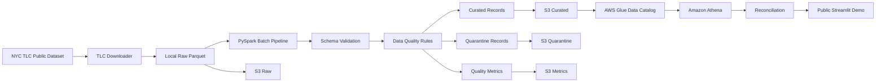

# TransitFlow

[](https://github.com/TheOrthman/transitflow/actions/workflows/tests.yml)
[](https://transitflowz.streamlit.app/)
[](https://www.python.org/)
[](https://spark.apache.org/)

**Live Demo:** [Open TransitFlow](https://transitflowz.streamlit.app/)

> A production-style batch data engineering platform built with PySpark and AWS for reliable ingestion, validation, data-quality enforcement, cloud publication, metadata management, and analytical reconciliation of NYC taxi trip data.

TransitFlow processes **31M+ NYC Yellow Taxi records** across eight monthly batches and focuses on practical data-platform concerns such as schema validation, warning and quarantine handling, checksum-based idempotency, S3 publication verification, AWS Glue partition repair, Amazon Athena reconciliation, automated testing, CI, and public verification.

---

## At a Glance

- **31M+ records processed**
- **8 monthly batches**
- **28 unit tests**
- **1 Spark integration test**
- **6 dashboard data validation tests**
- **35 total automated tests**
- **GitHub Actions CI**
- **Public Streamlit deployment**
- **Spark-to-Athena reconciliation**
- **Three independent idempotency layers**

---

## Live Demo

TransitFlow includes a public read-only dashboard where recruiters and reviewers can inspect pipeline outputs and engineering controls.

**[Open the live TransitFlow application](https://transitflowz.streamlit.app/)**

The demo exposes:

- monthly batch processing results
- valid, warning, and quarantine counts
- data-quality rules
- Spark-to-Athena reconciliation
- idempotency and reliability controls
- technology stack
- automated testing status

The application does **not** expose AWS credentials, administrative cloud access, unrestricted Athena access, or infrastructure permissions.


---

## What TransitFlow Demonstrates

TransitFlow is designed to go beyond a basic ETL script or analytics notebook.

It demonstrates:

- distributed batch processing with PySpark
- resilient source ingestion
- canonical schema normalization
- source-schema validation
- record-level data-quality classification
- warning and quarantine handling
- SHA-256 source verification
- processing idempotency
- S3 publication idempotency
- Hive-style partitioning
- AWS Glue partition registration and repair
- Amazon Athena querying
- Spark-to-Athena reconciliation
- unit and integration testing
- CI with GitHub Actions
- public read-only deployment

---

# Architecture



The pipeline separates processing, publication, metadata registration, and query verification so that failures in one layer can be detected and repaired independently.

---

## Demo Screenshots

### Pipeline Overview


### Data Quality


### Spark-to-Athena Reconciliation


**Live application:**  
[https://transitflowz.streamlit.app/](https://transitflowz.streamlit.app/)

---

# Technology Stack

| Layer | Technology |
|---|---|
| Language | Python |
| Distributed Processing | PySpark |
| Source Format | Apache Parquet |
| Data Validation | PySpark rules + schema validation |
| Cloud Storage | Amazon S3 |
| Metadata Catalog | AWS Glue Data Catalog |
| Query Engine | Amazon Athena |
| AWS Authentication | IAM Identity Center / SSO |
| Testing | pytest |
| CI | GitHub Actions |
| Version Control | Git / GitHub |
| Local Runtime | Linux / WSL2 |
| Demo Layer | Streamlit |

---

# Dataset

TransitFlow currently processes the public **NYC Taxi & Limousine Commission Yellow Taxi Trip Records** dataset.

Each monthly batch contains fields such as:

- pickup and dropoff timestamps
- pickup and dropoff location IDs
- passenger count
- trip distance
- payment type
- fare amount
- tip amount
- tolls
- taxes and surcharges
- total amount

The pipeline normalizes source column names into a canonical snake_case schema.

Examples:

```text
VendorID                  -> vendor_id
tpep_pickup_datetime      -> pickup_datetime
tpep_dropoff_datetime     -> dropoff_datetime
PULocationID              -> pickup_location_id
DOLocationID              -> dropoff_location_id
RatecodeID                -> rate_code_id
store_and_fwd_flag        -> store_and_forward_flag
Airport_fee               -> airport_fee
```

---

# Data Quality Architecture

TransitFlow distinguishes between records that are unusable for normal analytics and records that are unusual but may still represent legitimate source-system behavior.

## Quarantine Rules

Records are quarantined when they contain conditions that make them unsafe for standard analytical use.

Current quarantine reasons include:

```text
MISSING_PICKUP_DATETIME
MISSING_DROPOFF_DATETIME
INVALID_TIME_RANGE
NEGATIVE_TRIP_DISTANCE
MISSING_PICKUP_LOCATION
MISSING_DROPOFF_LOCATION
```

## Warning Rules

Warning records remain in the curated dataset while preserving their quality flags.

Current warning reasons include:

```text
ZERO_TRIP_DISTANCE
NEGATIVE_FARE_AMOUNT
NEGATIVE_TOTAL_AMOUNT
TRIP_OVER_24_HOURS
```

Negative fare and total amounts are treated as warnings rather than automatically discarded because they may represent corrections, reversals, refunds, or other source-system behavior.

## Validation Status

Every processed row receives one of:

```text
VALID
WARNING
QUARANTINE
```

If both warning and quarantine conditions exist, `QUARANTINE` takes precedence while all applicable quality reasons remain attached to the record.

This avoids silently discarding unusual data while still protecting downstream analytical quality.

---

# Lineage Metadata

TransitFlow enriches processed records with operational metadata:

```text
source_file
batch_id
schema_version
ingested_at
validation_status
quarantine_reasons
warning_reasons
```

This allows processed records to be traced back to their source batch and validation outcome.

---

# S3 Data Layout

TransitFlow separates cloud outputs by responsibility.

```text
s3://<bucket>/
│
├── raw/
│   └── yellow_taxi/
│
├── curated/
│   └── yellow_taxi/
│       └── year=2025/
│           ├── month=01/
│           ├── month=02/
│           ├── ...
│           └── month=08/
│
├── quarantine/
│   └── yellow_taxi/
│
├── metrics/
│   ├── quality/
│   ├── downloads/
│   └── pipeline_runs/
│
└── athena-results/
```

The curated layer uses **Hive-style partitioning**:

```text
year=YYYY/month=MM
```

Example:

```text
curated/yellow_taxi/year=2025/month=08/
```

---

# Reliability and Idempotency

One of TransitFlow's primary engineering goals is to make batch reruns safe.

The platform separates reliability into three independent control layers.

## 1. Processing Idempotency

Before Spark processing begins, TransitFlow calculates a SHA-256 checksum of the source file.

The run ledger is checked using:

```text
batch_id + source_checksum + SUCCESS status
```

If the same successful source batch has already been processed, the expensive Spark transformation can be skipped.

---

## 2. S3 Publication Idempotency

Processing success does not automatically imply successful publication.

TransitFlow independently verifies that:

- the raw S3 object exists
- its stored SHA-256 metadata matches the local source checksum
- curated output contains a `_SUCCESS` marker
- quarantine output contains a `_SUCCESS` marker
- quality metrics output contains a `_SUCCESS` marker

This allows incomplete cloud publication to be repaired without unnecessarily re-running Spark.

---

## 3. Glue Partition Idempotency

Glue metadata is verified independently from S3 publication.

TransitFlow validates:

```text
partition values
+
canonical S3 location
```

Expected partition values for August 2025:

```text
year = 2025
month = 08
```

Expected location:

```text
s3://<bucket>/curated/yellow_taxi/year=2025/month=08/
```

A correct partition is left unchanged.

An incorrect partition can be removed and recreated using the canonical S3 location.

This protects the query layer from silently pointing to the wrong storage prefix.

---

# Glue and Athena

The curated dataset is registered in AWS Glue as:

```text
Database: transitflow
Table: curated_yellow_taxi
```

Partitions:

```text
year INT
month INT
```

The physical S3 representation uses zero-padded month directories:

```text
month=01
month=02
...
month=08
```

Amazon Athena queries the Glue-registered curated partitions directly from S3.

---

# Batch Results

TransitFlow currently processes January through August 2025.

| Month | Source Records | Curated Records | Quarantined |
|---|---:|---:|---:|
| Jan 2025 | 3,475,226 | 3,475,102 | 124 |
| Feb 2025 | 3,577,543 | 3,577,450 | 93 |
| Mar 2025 | 4,145,257 | 4,145,176 | 81 |
| Apr 2025 | 3,970,553 | 3,970,390 | 163 |
| May 2025 | 4,591,845 | 4,591,744 | 101 |
| Jun 2025 | 4,322,960 | 4,322,729 | 231 |
| Jul 2025 | 3,898,963 | 3,898,962 | 1 |
| Aug 2025 | 3,574,091 | 3,574,089 | 2 |

All eight curated monthly counts were reconciled against Amazon Athena after Glue partition registration.

---

## Example: August 2025

```text
Source records:       3,574,091
Valid records:        3,227,851
Warning records:        346,238
Quarantined records:          2
Curated records:       3,574,089
```

The curated count was independently verified through Athena.

---

# Spark-to-Athena Reconciliation

A successful Spark job alone does not prove that the downstream query layer is correct.

TransitFlow verifies the complete path:

```text
PySpark
   |
   v
Amazon S3
   |
   v
AWS Glue
   |
   v
Amazon Athena
   |
   v
Reconciliation
```

For January through August 2025:

```text
Spark curated count == Athena count
```

for every processed monthly partition.

This provides independent verification of:

- Spark transformation output
- S3 publication
- Glue metadata registration
- Athena query visibility

---

# Testing

TransitFlow currently contains **35 passing automated tests**:

- **28 unit tests**
- **1 Spark integration test**
- **6 public-demo data validation tests**

Run the full suite:

```bash
python -m pytest tests/unit tests/integration -v
```

Current test coverage includes:

- batch configuration
- source schema validation
- canonical column normalization
- SHA-256 checksum generation
- checksum determinism
- data-quality classification
- warning behavior
- quarantine behavior
- warning/quarantine precedence
- run-ledger idempotency
- S3 publication-state logic
- Hive partition path generation
- zero-padded partition values
- Glue partition existence
- Glue partition location validation
- incorrect Glue partition replacement
- end-to-end local Spark batch execution
- dashboard metric consistency
- dashboard Spark-to-Athena reconciliation

AWS-facing unit tests use mocks, allowing the test suite and GitHub Actions CI to run without requiring live AWS API access.

---

# Continuous Integration

TransitFlow uses **GitHub Actions** to automatically run its test suite on:

- pushes to `main`
- pull requests targeting `main`

The CI environment provisions:

- Linux
- Java 17
- Python
- project dependencies
- pytest

A green CI check verifies that the current repository state passes the automated test suite.

---

# Repository Structure

```text
transitflow/
│
├── .github/
│   └── workflows/
│       └── tests.yml
│
├── app/
│   ├── app.py
│   └── data/
│       └── batch_metrics.csv
│
├── docs/
│   ├── architecture/
│   │   └── transitflow_architecture.md
│   │
│   ├── decisions/
│   │   ├── 001-separate-processing-publication-state.md
│   │   └── 002-warning-vs-quarantine.md
│   │
│   └── screenshots/
│       ├── overview.png
│       ├── data_quality.png
│       └── reconciliation.png
│
├── sql/
│   └── create_curated_yellow_taxi.sql
│
├── src/
│   ├── common/
│   │   ├── config.py
│   │   ├── logging.py
│   │   └── run_context.py
│   │
│   ├── ingestion/
│   │   ├── tlc_downloader.py
│   │   └── tlc_reader.py
│   │
│   ├── pipeline/
│   │   └── batch_pipeline.py
│   │
│   ├── quality/
│   │   └── metrics.py
│   │
│   ├── storage/
│   │   ├── __init__.py
│   │   ├── batch_publisher.py
│   │   ├── glue_catalog.py
│   │   └── s3_storage.py
│   │
│   ├── transforms/
│   │   └── trips.py
│   │
│   └── validation/
│       ├── quarantine.py
│       ├── rules.py
│       └── schema.py
│
├── tests/
│   ├── unit/
│   │   ├── test_app_data.py
│   │   ├── test_batch_publisher.py
│   │   ├── test_cloud_state.py
│   │   ├── test_config.py
│   │   ├── test_glue_catalog.py
│   │   ├── test_quality_rules.py
│   │   ├── test_run_context.py
│   │   ├── test_run_ledger.py
│   │   └── test_schema.py
│   │
│   └── integration/
│       └── test_batch_pipeline.py
│
├── .gitignore
├── README.md
├── requirements.txt
├── run_batches.py
└── run_ingestion.py
```

Generated raw data, curated data, quarantine data, metrics, virtual environments, temporary files, and local Spark artifacts are intentionally excluded from Git.

---

# Running Locally

TransitFlow is currently developed and tested under Linux using WSL2.

## 1. Clone the repository

```bash
git clone git@github.com:TheOrthman/transitflow.git
cd transitflow
```

Alternatively, clone using HTTPS:

```bash
git clone https://github.com/TheOrthman/transitflow.git
cd transitflow
```

## 2. Create a virtual environment

```bash
python -m venv .venv-wsl
source .venv-wsl/bin/activate
```

## 3. Install dependencies

```bash
python -m pip install --upgrade pip
python -m pip install -r requirements.txt
```

## 4. Run the test suite

```bash
python -m pytest tests/unit tests/integration -v
```

## 5. Run the Streamlit demo

```bash
streamlit run app/app.py
```

Then open:

```text
http://localhost:8501
```

## 6. Run batch orchestration

```bash
python run_batches.py
```

AWS publication requires a configured and authorized AWS environment.

The development environment uses AWS IAM Identity Center rather than long-lived AWS access keys.

---

# Security

TransitFlow does not store AWS credentials in the repository.

The project excludes:

- AWS credentials
- local `.env` files
- private keys
- virtual environments
- generated datasets
- Spark temporary artifacts
- pipeline metrics
- local runtime state

The public Streamlit application is read-only and does not expose:

- AWS credentials
- AWS console access
- unrestricted Athena access
- administrative S3 access
- IAM configuration
- private infrastructure controls

---

# Architecture Decisions

TransitFlow documents key engineering decisions using Architecture Decision Records.

## ADR 001 — Separate Processing State from Publication State

Processing success, S3 publication success, and Glue registration success are tracked independently.

This allows cloud publication failures to be repaired without unnecessarily repeating expensive Spark transformations.

See:

```text
docs/decisions/001-separate-processing-publication-state.md
```

## ADR 002 — Warning vs Quarantine

TransitFlow distinguishes unusual-but-usable records from records unsafe for standard analytics.

Warning records remain in the curated layer.

Quarantined records are separated for investigation.

See:

```text
docs/decisions/002-warning-vs-quarantine.md
```

---

# Engineering Principles

TransitFlow is built around several principles:

1. **Do not silently discard bad or unusual data**
2. **Make batch reruns safe**
3. **Separate processing state from publication state**
4. **Preserve record-level quality context**
5. **Make cloud storage layouts predictable**
6. **Verify metadata instead of assuming it is correct**
7. **Make pipeline outputs independently verifiable**
8. **Test failure-prone control logic without requiring live cloud access**

---

# Planned Improvements

Potential future improvements include:

- richer pipeline observability
- automated Athena reconciliation jobs
- performance benchmarking
- stricter least-privilege AWS permissions
- Dockerized execution
- infrastructure-as-code
- scheduled orchestration
- automated alerting
- optional Apache Iceberg extension
- optional streaming architecture
- additional integration tests

---

# Author

**Usman Ahmadu Shuaibu**

Data Engineer

GitHub: [TheOrthman](https://github.com/TheOrthman)

Live project: [TransitFlow](https://transitflowz.streamlit.app/)

---

# Project Status

**Active Development — Core Platform Complete**

```text
✅ Local PySpark batch pipeline
✅ Source download resilience
✅ Schema validation
✅ Canonical schema normalization
✅ Data-quality framework
✅ Warning classification
✅ Quarantine architecture
✅ Batch quality metrics
✅ SHA-256 source verification
✅ Processing idempotency
✅ S3 publication
✅ S3 publication verification
✅ Hive-partitioned curated layer
✅ AWS Glue catalog integration
✅ Glue partition validation and repair
✅ Amazon Athena querying
✅ Jan–Aug 2025 reconciliation
✅ 35 automated tests
✅ Spark integration testing
✅ GitHub Actions CI
✅ Architecture documentation
✅ Architecture Decision Records
✅ Recruiter-facing Streamlit application
✅ Public deployment
```

---

## Links

**Live Demo:**  
[https://transitflowz.streamlit.app/](https://transitflowz.streamlit.app/)

**GitHub Repository:**  
[https://github.com/TheOrthman/transitflow](https://github.com/TheOrthman/transitflow)